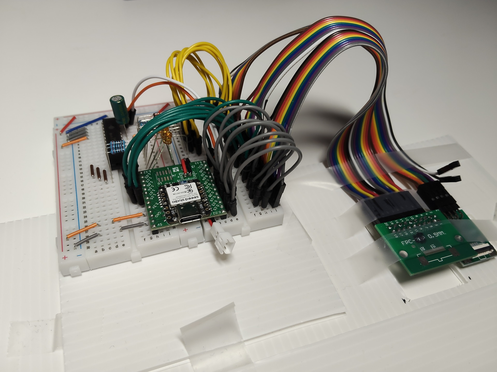
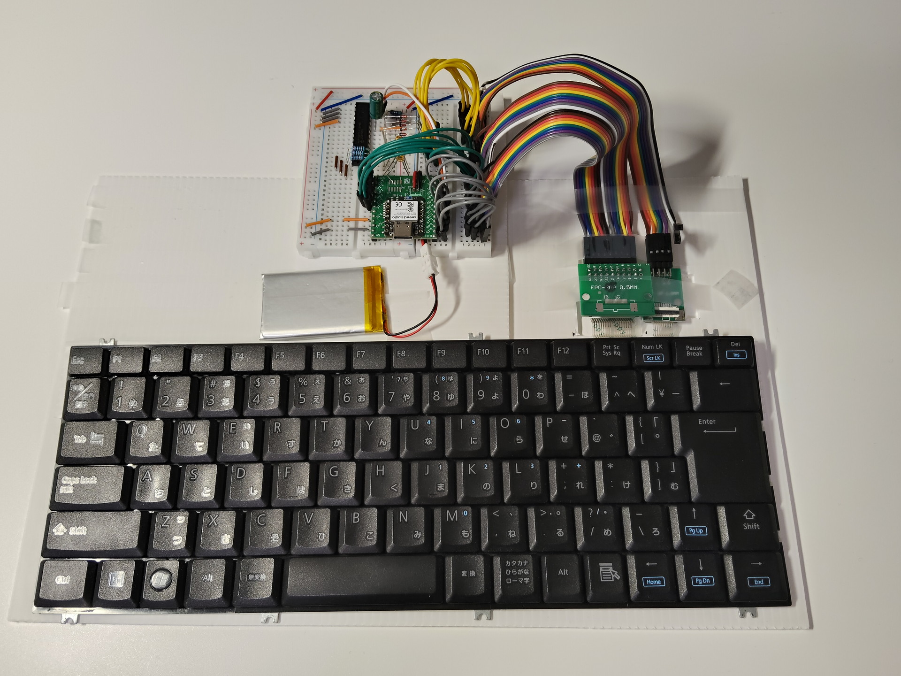
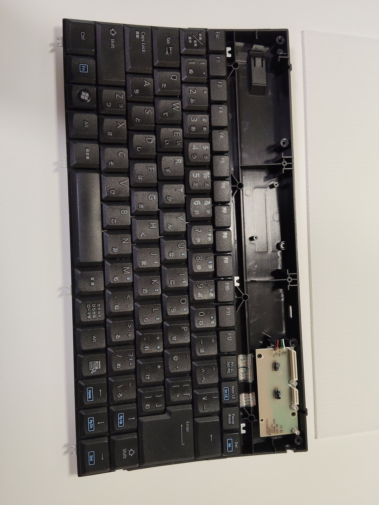
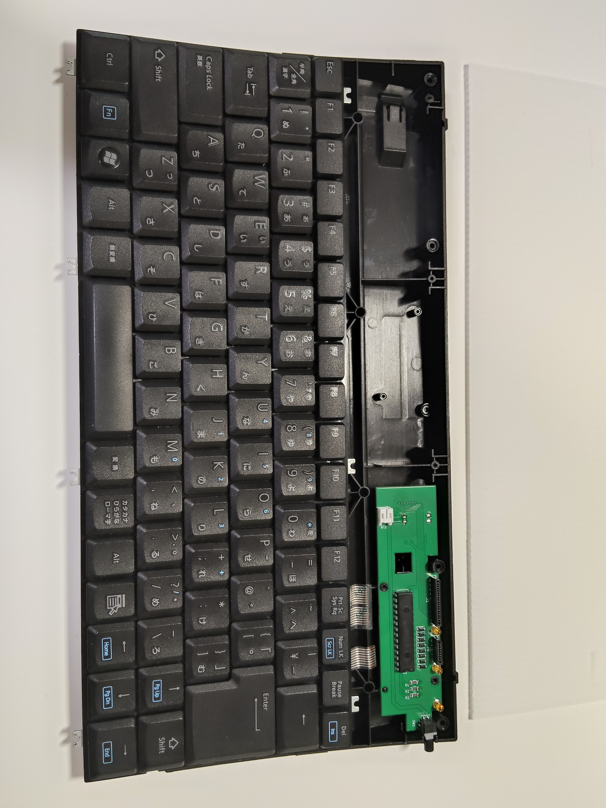

# TK-FCP026BK 自作キーボード化プロジェクト

---

## 1. プロジェクト概要

### 目的
市販キーボード TK-FCP026BK を 自作基板( XIAO nRF52840 plus + MCP23017 )、ZMKでワイヤレス(BLE)化する。

## 2. 完成版
v3で完成。仕様は Wiki 参照

<table>
  <tr>
    <td width="25%"><a href="images/02_proto2.jpg"></a></td>
    <td width="25%"><a href="images/01_proto1.jpg"></a></td>
    <td width="25%"><a href="images/03_base.jpg"></a></td>
    <td width="25%"><a href="images/04_zmk.jpg"></a></td>
  </tr>
</table>

## 3. Verと概要
| Ver | 概要 | SMD |
|---|---|---|
| Prototype | ブレッドボードで学習・技術検証|XIAO nRF52840 |
| v1 | 動作確認できたので一旦ベースラインとして確保。KiCadで回路設計 | XIAO nRF52840 |
| v2 | KiCadの回路設計を最適化。回路にあわせv1のコードを変更 | XIAO nRF52840 |
| v3 | SMDをXIAO nRF52840 **plus** に変更 | XIAO nRF52840 **plus** |

- v1～v3はフォルダ構成と対応
- Prototype は別リポジトリ https://github.com/til-s/zmk-tk-fcp026bk_Prototype 参照

#### Prototypeでの作業概要
ほとんどClaudeに教えてもらいました

| 作業概要 | ProtoTypeのReadmeの参考章 |
|---|---|
| Claudeに構築の戦略を相談。必要部品を教えてもらい購入 | 2. ブレッドボード接続 |
| Claudeに聞いて、ブレッドボードで XIAO nRF52840、MCP23017 他を配線 |  |
| Arduino IDE で XIAO nRF52840、MCP23017 の動作確認。コードはClaude提供 | 3. 接続確認プログラムと実行方法 |
| Arduino IDE で キーマップ確認。確認用のコードはClaude提供 | 4. キーマップ確認用プログラム |
| Claudeに ZMK GitHub ビルド用ソースの出力を依頼 | 5. ZMK GitHub ビルド用ソース |
| GitHubにソースを配置、ビルドおよび動作確認の試行錯誤 | 6. ZMK動作確認と試行錯誤の記録 |
|  | 7. 配線変更と動作確定 |
|  | 8. 追加機能実装 |
|  | 9. ゴーストキー問題と対策 |
|  | 10. 追加機能実装 |

## 4. フォルダ構成
```
zmk-tk-fcp026bk/
├── .github/
│   └── workflows/
│        └── build.yml
├── builds/
│   └── build-v1～3.yaml
├── config/
│   ├── boards/shields/
│   │   ├── tk_fcp026bk/
│   │   ├── tk_fcp026bk_v2/
│   │   └── tk_fcp026bk_v3/
│   │       ├── keymaps/
│   │       │  └── tk_fcp026bk.keymap
│   │       ├── src/
│   │       │  └── numlock_layer_led.c
│   │       ├── Kconfig.defconfig
│   │       ├── Kconfig.shield
│   │       ├── tk_fcp026bk_v3.conf
│   │       └── tk_fcp026bk_v3.overlay
│   ├── zephyr/
│   │   └── module.yml
│   └── west.yml
└── kicad/
     ├── tk_fcp026bk/
     ├── tk_fcp026bk_v2/
     └── tk_fcp026bk_v3/
```
---
### `.github/workflows/build.yml`

用途: GitHub Actionsに対するビルド指示書。ビルドする対象(build-v1～3.yaml)を選択し、ZMKでコンパイルを実行。

意味: 「ZMKのビルド環境（コンテナ）を起動し、build-v1～3.yamlを引き渡してコンパイルを実行する」という指示が書かれています。

---
### `builds/build-v1～3.yaml`

用途: 「ボード（マイコン）」と、どの「シールド（キーボード基盤）」を記載。。

意味: どの「ボード（マイコン）」と、どの「シールド（キーボード基盤）」を組み合わせてビルドするかを定義。

---
### `config/boards/shields/tk_fcp026bk_v3/keymaps/tk_fcp026bk.keymap`

用途: キーマップ（配列）定義ファイル。

意味: 配線されたマトリクスに対し、具体的にどのキー（A, B, Space, Layer切り替えなど）を割り当てるかを設定します。普段一番編集するファイル。

---
### `config/boards/shields/tk_fcp026bk_v3/keymaps/src/numlock_layer_led.c`

用途: NumLockのLEDをLayerと同期させるための制御用モジュール

意味: ZMK標準ではOSのNumLockステータスとLEDが同期する。

　　  このキーボードではNumLockはLayerで実装していて不一致になるのでLayer状態に従って表示させるための独自モジュール。
---
### `config/boards/shields/tk_fcp026bk/Kconfig.defconfig`

用途: キーボードのデフォルト内部設定ファイル。

意味: 画面（OLED）の有無、RGB LEDの有効化、キーボード名（Bluetoothで見える名前）など、システム裏側の初期値を設定します。

---
### `config/boards/shields/tk_fcp026bk/Kconfig.shield`

用途: シールドの存在をZMKに登録するファイル。

意味: SHIELD_TK_FCP026BK という名前のキーボードが存在することをシステムに認識させます。

---
### `config/boards/shields/tk_fcp026bk/tk_fcp026bk.overlay`

用途: ハードウェアの配線図（デバイストリ）ファイル。

意味: マイコンのどのピン（例：P0.01）が、キーマトリクスのどの行（Row）や列（Column）に繋がっているかを物理的にマッピングします。

---
### `config/west.yml`

用途: ZMKの依存関係（ライブラリ）管理ファイル。

意味: westというZephyrのツールに対し、どのバージョンのZMKソースコードをダウンロードして組み合わせるかを指定します。

---
### `kicad/tk_fcp026bk_v3/`

用途: KiCadのプロジェクトファイル

意味: 物理的な基盤の設計。

---

*作成日：2026-06-01 / 更新日：2026-06-24*
